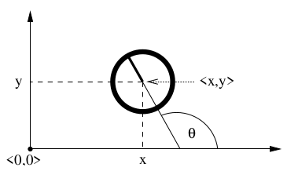

# Robot Motion

The main goal of this repository is study and document the aspects and concepts of Motion Models and its implementations. At the begging, we'll follow with the teoric and codding for general robotics implementations, and then we'll particularize it to aerial robotics, which is the objective of this cientific research. 

## Motion Models

The motion models are the mathematical representation of the movement of a robot. They are used to predict the position of the robot in the future, based on the current position and the control inputs. 

The configuration of a rigif body uf often described by six variables, its three-Cartesian coordinates and its three Euler angles(roll, pitch and yaw). For planar environments, in example, we can denote the *pose* of the robot by its x and y coordinate, along with its angular orientation.

$$ X_i = 
\begin{pmatrix}
    x \\ y \\ \theta
\end{pmatrix}
$$

Note: pose without orientation is called location.

  

For the study of probabilistic motion models $p(x_t | u_t, x_{t-1})$, we'll discuss the **Odometry Motion Model**, which assumes that one is provided with odometry information.

